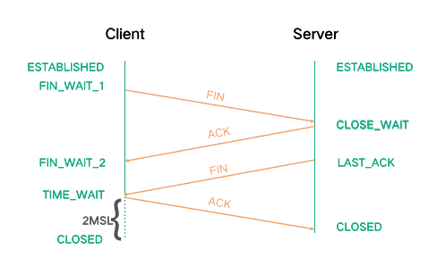

### **1、OSI七层模型与TCP/IP 五层模型、以及对应的协议**

**OSI七层**：

+ 应用层（DNS、HTTP协议、SMTP、FTP）
+ 表示层
+ 会话层
+ 传输层（TCP、UDP）
+ 网络层（IP 、ICMP、路由器、防火墙）
+ 数据链路层（网卡、网桥、交换机）
+ 物理层（中继器、集线器）

**TCP/IP四层**：

+ 应用层
+ 传输层
+ 网际层
+ 网络接口层（数据链路层、物理层）

### 2、TCP与UDP区别和应用场景，基于TCP的协议有哪些，基于UDP的有哪些** 

| 类型 |            特点            |          性能          |    应用过场景    | 首部字节 |      |
| ---- | :------------------------: | :--------------------: | :--------------: | :------: | ---- |
| TCP  |   面向连接、可靠、字节流   | 传输效率慢、所需资源多 |  文件、邮件传输  |  20-60   |      |
| UDP  | 无连接、不可靠、数据报文段 | 传输效率快、所需资源少 | 语音、视频、直播 | 8个字节  |      |

​	**基于TCP的协议**：HTTP（超文本传输协议）、FTP（文件传输协议）、SMTP（简单邮件传输协议）

​	**基于UDP的协议**：RIP（路由信息协议）、DNS（域名系统）、SNMP（简单网络管理协议）

### **3、TCP如何保证可靠传输的**

​		**TCP通过**：应用数据分割、对数据包进行编号、校验和、流量控制、拥塞控制、ARQ协议、超时重传等措施保证数据的可靠传输；

​		**流量控制**：TCP连接的每一方都有固定大小的缓冲空间，TCP的接收端只允许发送端发送接收端缓冲区能接纳的数据。当接收方来不及处理发送方的数据，能提示发送方降低发送的速率，防止包丢失。TCP使用的流量控制协议是可变大小的**滑动窗口协议**。（TCP利用滑动窗口实现流量控制）

​		**拥塞控制目的**：为了防止过多的数据注入到网络中，避免网络中的路由器、链路过载

​		**拥塞控制过程**：TCP发送方将维护一个拥塞窗口的状态变量，该变量随着网络拥塞程度动态变化，发送方让自己的发送窗口取为拥塞窗口和接收方接收窗口中较小的一个。通过**慢开始**、**拥塞避免**、**快重传**、**快恢复**等算法减少网络拥塞的发生。

| 算法           | 原理                                                         |
| -------------- | ------------------------------------------------------------ |
| 慢开始         | 拥塞窗口的大小由小逐渐变大，初始窗口大小为1，每经过一个传播轮次加倍 |
| 拥塞避免       | 让拥塞窗口缓慢变大，每经过一个往返时间RTT就把窗口大小+1      |
| 快重传与快恢复 | 这里简称FRR，如果没有FRR数据包丢了就会暂停进行补救，有FRR的话如果接收到一个不按顺序的数据段，它会立即给发送机发送一个重复确认。如果发送机接收到三个重复确认，它会假定确认中指出的数据端丢失了，并立即重传这个丢失的数据段。 |

​		**ARQ协议**：自动重传协议是OSI中数据链路层和传输层的错误纠正协议。它使用确认和超时这两个机制，在不可靠的服务基础上实现可靠的信息传输。如果发送方在发送后一段时间内没有收到确认，它会重新发送。ARQ包括**等待ARQ协议**和**连续ARQ协议**。

|          | **等待ARQ协议**                                              | **连续ARQ协议**                                              |
| :------- | ------------------------------------------------------------ | ------------------------------------------------------------ |
| 基本原理 | 每发完一个分组就停止发送，等待对方确认。如果超时还没收到确认，说明没有发送成功过，需要重新发送，直到收到确认后再发下一个分组；若接收方收到重复分组，就丢弃该分组，但同时还要发送确认； | 发送方维持一个发送窗口，凡位于发送窗口内的分组可以连续发送出去，而不需要等待对方确认。接收方一般采用累计确认，对按序到达的最后一个分组发送确认，表明到这个分组为止的所有分组都已经正确收到了。 |
| 优点     | 简单                                                         | 信道利用率高，容易实现，即使确认丢失，也不必重传。           |
| 缺点     | 信道利用率低，等待时间长                                     | 不能向发送方反映出接收方已经正确收到的所有分组的信息。       |

​		**超时重传**：当TCP发出一个段后，它启动一个定时器，等待目的端确认收到这个报文段。如果不能及时收到一个确认，将重发这个报文段。

​		

### 4、TCP三次握手过程以及每次握手后的状态改变，为什么三次？  为什么两次不行？**

​	**三次握手过程**：

​		客户端——发送带有SYN标志的数据包——服务端       **一次握手**  Client进入syn_sent状态

​		服务端——发送带有SYN/ACK标志的数据包——客户端   **二次握手**  服务端进入syn_rcvd

​		客户端——发送带有ACK标志的数据包——服务端               **三次握手**   连接就进入Established状态

​	**为什么三次**：

​		主要是为了建立可靠的通信信道，保证客户端与服务端同时具备发送、接收数据的能力

​	**为什么两次不行？**

​		1、防止已失效的请求报文又传送到了服务端，建立了多余的链接，浪费资源

​		2、 两次握手只能保证单向连接是畅通的。（为了实现可靠数据传输， TCP 协议的通信双方， 都必须维护一个序列号， 以标识发送出去的数据包中， 哪些是已经被对方收到的。 三次握手的过程即是通信双方相互告知序列号起始值， 并确认对方已经收到了序列号起始值的必经步骤；如果只是两次握手， 至多只有连接发起方的起始序列号能被确认， 另一方选择的序列号则得不到确认）

​	**为什么要传回SYN**

​		接收端传回发送端的SYN是为了告诉发送端，我接收到的信息确实就是你所发送的信号了。

​	**传了SYN，为啥还要传ACK（确认序号有效）？**

​		双方通信无误必须是两者互相发送信息都无误。传了SYN，证明发送方到接收方的通道没有问题，但是接收方到发送方的通道还需要ACK信号来进行验证。

​	**说说SYN洪水攻击？**

​	SYN 洪水攻击发生的原因，就是 Server 端收到 Client 端的 SYN 请求后，发送了 ACK 和 SYN，但是 Client 端不进行回复，导致 Server 端大量的链接处在 SYN_RCVD 状态，进而影响其他正常请求的建连。

​	可以设置 tcp_synack_retries = 0 加快半链接的回收速度，或者调大 tcp_max_syn_backlog 来应对少量的 SYN 洪水攻击

### **5、TCP四次挥手过程以及状态改变，为什么四次？CLOSE-WAIT和TIME-WAIT存在的意义？如何查看TIME-WAIT状态的链接数量？为什么会TIME-WAIT过多？解决方法是怎样的？** 

**四次挥手过程：**

​	客户端——发送带有FIN标志的数据包——服务端，关闭与服务端的连接 ，客户端进入FIN-WAIT-1状态

​	服务端收到这个 FIN，它发回一个 ACK，确认序号为收到的序号加1，服务端就进入了CLOSE-WAIT状态

​	服务端——发送⼀个FIN数据包——客户端，关闭与客户端的连接，客户端就进入FIN-WAIT-2状态

​	客户端收到这个 FIN，发回 ACK 报文确认，并将确认序号设置为收到序号加1，TIME-WAIT状态

TIME_WAIT 状态下需要等待 2 倍的最大报文段生存时间，来保证链接的可靠关闭，之后才会进入 CLOSED 关闭状态。而 Server 端收到 ACK 后直接就进入 CLOSED 状态。

**为什么四次**：

​	因为需要确保客户端与服务端的数据能够完成传输。

**CLOSE-WAIT**：

​	这种状态的含义其实是表示在等待关闭

**TIME-WAIT**：

​	为了解决网络的丢包和网络不稳定所带来的其他问题，确保连接方能在时间范围内，关闭自己的连接

**TIME_WAIT 或者 CLOSE_WAIT 状态的问题**

​	实际应用中有可能遇到大量 Socket 处在 TIME_WAIT 或者 CLOSE_WAIT 状态的问题。

​	一般开启 tcp_tw_reuse 和 tcp_tw_recycle 能够加快 TIME-WAIT 的 Sockets 回收；

​	而大量 CLOSE_WAIT 可能是被动关闭的一方存在代码 bug，没有正确关闭链接导致的。

**如何查看TIME-WAIT状态的链接数量？**		

​	netstat -an |grep TIME_WAIT|wc -l  查看连接数等待time_wait状态连接数

**为什么会TIME-WAIT过多？解决方法是怎样的？**

​	**可能原因**： 高并发短连接的TCP服务器上，当服务器处理完请求后立刻按照主动正常关闭连接

​	**解决**：开启 tcp_tw_reuse 和 tcp_tw_recycle 能够加快 TIME-WAIT 的 Sockets 回收；

### **6、TCP粘包现象原因和解决方法** 

​	**TCP粘包是指**：发送方发送的若干包数据到接收方接收时粘成一包

​	**发送方原因**：

​		TCP默认使用Nagle算法（主要作用：减少网络中报文段的数量），而Nagle算法会**对较小的数据包进行合并**然后再发送，那么这样的话，服务器在接收到消息（数据流）的时候就**无法区分哪些数据包是客户端自己分开发送的**，这样产生了粘包。
​		Nagle算法造成了发送方可能会出现粘包问题

​	**接收方原因**：

​		TCP接收到数据包时，并不会马上交到应用层进行处理，或者说应用层并不会立即处理。实际上，TCP将接收到的数据包保存在接收缓存里，然后应用程序主动从缓存读取收到的分组。这样一来，如果TCP接收数据包到缓存的速度大于应用程序从缓存中读取数据包的速度，多个包就会被缓存，应用程序就有可能读取到多个首尾相接粘到一起的包。

​	**解决粘包问题**：

​		最本质原因在与接收对等方无法分辨消息与消息之间的边界在哪，通过使用某种方案给出边界，例如：

- 发送定长包。如果每个消息的大小都是一样的，那么在接收对等方只要累计接收数据，直到数据等于一个定长的数值就将它作为一个消息。
- 包头加上包体长度。包头是定长的4个字节，说明了包体的长度。接收对等方先接收包体长度，依据包体长度来接收包体。

### **7、TCP、UDP、IP、以太网报文格式以及重要字段，报文从一端到另一端传递的过程。** 

​	**TCP报文格式**：

​		

​	**源端口号和目的端口号**：

​		用于寻找发端和收端应用进程。这两个值加上ip首部源端ip地址和目的端ip地址唯一确定一个tcp连接。

​	**序号字段**：

​		序号用来标识从TCP发端向TCP收端发送的数据字节流，它表示在这个报文段中的第一个数据字节的序号。如果将字节流看作在两个应用程序间的单向流动，则 TCP用序号对每个字节进行计数。序号是32 bit的无符号数，序号到达 2^32-1后又从0开始。

　　当建立一个新的连接时，SYN标志变1。序号字段包含由这个主机选择的该连接的初始序号ISN（Initial Sequence Number）。该主机要发送数据的第一个字节序号为这个ISN加1，因为SYN标志消耗了一个序号

​	**确认序号**：

​		既然每个传输的字节都被计数，确认序号包含发送确认的一端所期望收到的下一个序号。因此，确认序号应当是上次已成功收到数据字节序号加 1。只有ACK标志为 1时确认序号字段才有效。发送ACK无需任何代价，因为 32 bit的确认序号字段和ACK标志一样，总是TCP首部的一部分。因此，我们看到一旦一个连接建立起来，这个字段总是被设置， ACK标志也总是被设置为1。TCP为应用层提供全双工服务。这意味数据能在两个方向上独立地进行传输。因此，连接的每一端必须保持每个方向上的传输数据序号。

​	**首都长度**：

​		首部长度给出首部中 32 bit字的数目。需要这个值是因为任选字段的长度是可变的。这个字段占4 bit，因此T C P最多有6 0字节的首部。然而，没有任选字段，正常的长度是 20字节。

​	**标志字段**：在T C P首部中有 6个标志比特。它们中的多个可同时被设置为1.
　　URG紧急指针（urgent pointer）有效
　　ACK确认序号有效。
　　PSH接收方应该尽快将这个报文段交给应用层。
　　RST重建连接。
　　SYN同步序号用来发起一个连接。
　　FIN发端完成发送任务。

​	**窗口大小**：

​		TCP的流量控制由连接的每一端通过声明的窗口大小来提供。窗口大小为字节数，起始于确认序号字段指明的值，这个值是接收端期望接收的字节。窗口大小是一个 16 bit字段，因而窗口大小最大为 65535字节。

​	**检验和**：

​		检验和覆盖了整个的 T C P报文段：T C P首部和T C P数据。这是一个强制性的字段，一定是由发端计算和存储，并由收端进行验证。

​	**紧急指针**：

​		只有当URG标志置1时紧急指针才有效。紧急指针是一个正的偏移量，和序号字段中的值相加表示紧急数据最后一个字节的序号。 T C P的紧急方式是发送端向另一端发送紧急数据的一种方式。

​	**选项**：

​		最常见的可选字段是最长报文大小，又称为 MSS (Maximum Segment Size)。每个连接方通常都在通信的第一个报文段（为建立连接而设置 S Y N标志的那个段）中指明这个选项。它指明本端所能接收的最大长度的报文段。

​	**UDP报文格式**：

​	

​	**端口号**：

​		用来表示发送和接受进程。由于 I P层已经把I P数据报分配给T C P或U D P（根据I P首部中协议字段值），因此T C P端口号由T C P来查看，而 U D P端口号由UDP来查看。T C P端口号与UDP端口号是相互独立的。

​	**长度**：

​		UDP长度字段指的是UDP首部和UDP数据的字节长度。该字段的最小值为 8字节（发送一份0字节的UDP数据报是 O K）。

​	**检验和**：

​		UDP检验和是一个端到端的检验和。它由发送端计算，然后由接收端验证。其目的是为了发现UDP首部和数据在发送端到接收端之间发生的任何改动。

​	**IP报文格式**：普通的IP首部长为20个字节，除非含有可选项字段。

​	

​	**4位版本**：

​		目前协议版本号是4，因此IP有时也称作IPV4.

​	**4位首部长度**：

​		首部长度指的是首部占32bit字的数目，包括任何选项。由于它是一个4比特字段，因此首部长度最长为60个字节。

​	**服务类型（TOS）**：

​		服务类型字段包括一个3bit的优先权字段（现在已经被忽略），4bit的TOS子字段和1bit未用位必须置0。4bit的TOS分别代表：最小时延，最大吞吐量，最高可靠性和最小费用。4bit中只能置其中1比特。如果所有4bit均为0，那么就意味着是一般服务。

​	**总长度**：

​		总长度字段是指整个IP数据报的长度，以字节为单位。利用首部长度和总长度字段，就可以知道IP数据报中数据内容的起始位置和长度。由于该字段长16bit，所以IP数据报最长可达65535字节。当数据报被分片时，该字段的值也随着变化。

​	**标识字段**：

​		标识字段唯一地标识主机发送的每一份数据报。通常每发送一份报文它的值就会加1。

​	**生存时间**：

​		TTL（time-to-live）生存时间字段设置了数据报可以经过的最多路由器数。它指定了数据报的生存时间。TTL的初始值由源主机设置（通常为 3 2或6 4），一旦经过一个处理它的路由器，它的值就减去 1。当该字段的值为 0时，数据报就被丢弃，并发送 ICMP 报文通知源主机。

​	**首部检验和**：

​		首部检验和字段是根据 I P首部计算的检验和码。它不对首部后面的数据进行计算。 ICMP、IGMP、UDP和TCP在它们各自的首部中均含有同时覆盖首部和数据检验和码。

​	**以太网报文格式**：

​	**目的地址和源地址**：

​		是指网卡的硬件地址（也叫MAC 地址），长度是48 位，是在网卡出厂时固化的。

​	**数据**：

​		以太网帧中的数据长度规定最小46 字节，最大1500 字节，ARP 和RARP 数据包的长度不够46 字节，要在后面补填充位。最大值1500 称为以太网的最大传输单元（MTU），不同的网络类型有不同的MTU，如果一个数据包从以太网路由到拨号链路上，数据包度大于拨号链路的MTU了，则需要对数据包进行分片fragmentation）。ifconfig 命令的输出中也有“MTU:1500”。注意，MTU 个概念指数据帧中有效载荷的最大长度，不包括帧首部的长度。

### **8、浏览器输入URL并回车的过程以及相关协议，DNS查询过程。** 

​	**过程**：DNS解析、TCP连接、发送HTTP请求、服务器处理请求并返回HTTP报文、浏览器渲染、结束

| 过程                                                         | 使用的协议            |
| ------------------------------------------------------------ | --------------------- |
| 1、浏览器查找域名DNS的IP地址 DNS查找过程（浏览器缓存、路由器缓存、DNS缓存） | DNS：获取域名对应的ip |
| 2、根据ip建立TCP连接                                         | TCP：与服务器建立连接 |
| 3、浏览器向服务器发送HTTP请求                                | HTTP：发送请求        |
| 4、服务器响应HTTP响应                                        | HTTP                  |
| 5、浏览器进行渲染                                            |                       |

### **9、HTTP1.0、1.1、2.0之间的区别** 

​	**HTTP1.0**：默认使用Connection:cloose，浏览器每次请求都需要与服务器建立一个TCP连接，服务器处理完成后立即断开TCP连接（无连接），服务器不跟踪每个客户端也不记录过去的请求（无状态）。

​	**HTTP1.1**：默认使用Connection:keep-alive（长连接），避免了连接建立和释放的开销；通过Content-Length字段来判断当前请求的数据是否已经全部接受。不允许同时存在两个并行的响应。

​	**HTTP2.0**：引入二进制数据帧和流的概念，其中帧对数据进行顺序标识；因为有了序列，服务器可以并行的传输数据。

​	**http1.0和http1.1的主要区别如下**：
​		1、缓存处理：1.1添加更多的缓存控制策略（如：Entity tag，If-Match）
​		2、网络连接的优化：1.1支持断点续传
​		3、错误状态码的增多：1.1新增了24个错误状态响应码，丰富的错误码更加明确各个状态
​		4、Host头处理：支持Host头域，不在以IP为请求方标志
​		5、长连接：减少了建立和关闭连接的消耗和延迟。

​	**http1.1和http2.0的主要区别**：
​		1、新的传输格式：2.0使用二进制格式，1.0依然使用基于文本格式
​		2、多路复用：连接共享，不同的request可以使用同一个连接传输（最后根据每个request上的id号组合成			  正常的请求）
​		3、header压缩：由于1.X中header带有大量的信息，并且得重复传输，2.0使用encoder来减少需要传输的			  hearder大小
​		4、服务端推送：同google的SPDUY（1.0的一种升级）一样

### **10、HTTP与HTTPS之间的区别，HTTPS链接建立的过程，了解对称加密算法和非对称加密算法不？**

​		**HTTP与HTTPS之间的区别**：

|              HTTP              |                  HTTPS                   |
| :----------------------------: | :--------------------------------------: |
|           默认端口80           |           HTTPS默认使用端口443           |
| 明文传输、数据未加密、安全性差 |       传输过程ssl加密、安全性较好        |
|     响应速度快、消耗资源少     | 响应速度较慢、消耗资源多、需要用到CA证书 |

​		**HTTPS链接建立的过程**：

​			1.首先客户端先给服务器发送一个请求

​			2.服务器发送一个SSL证书给客户端，内容包括：证书的发布机构、有效期、所有者、签名以及公钥

​			3.客户端对发来的公钥进行真伪校验，校验为真则使用公钥对对称加密算法以及对称密钥进行加密

​			4.服务器端使用私钥进行解密并使用对称密钥加密确认信息发送给客户端

​			5.随后客户端和服务端就使用对称密钥进行信息传输

​		**对称加密算法**：

​			双方持有相同的密钥，且加密速度快，典型对称加密算法：DES、AES

​		**非对称加密算法**：

​			密钥成对出现（私钥、公钥），私钥只有自己知道，不在网络中传输；而公钥可以公开。相比对称加密速度较慢，典型的非对称加密算法有：RSA、DSA

### **11、HTTP请求有哪些。get和Post区别。** 

**HTTP请求**：

| 方法    | 描述                                                         |
| :------ | ------------------------------------------------------------ |
| GET     | 向特定资源发送请求，查询数据，并返回实体                     |
| POST    | 向指定资源提交数据进行处理请求，可能会导致新的资源建立、已有资源修改 |
| PUT     | 向服务器上传新的内容                                         |
| HEAD    | 类似GET请求，返回的响应中没有具体的内容，用于获取报头        |
| DELETE  | 请求服务器删除指定标识的资源                                 |
| OPTIONS | 可以用来向服务器发送请求来测试服务器的功能性                 |
| TRACE   | 回显服务器收到的请求，用于测试或诊断                         |
| CONNECT | HTTP/1.1协议中预留给能够将连接改为管道方式的代理服务器       |

**get和Post区别**：

|          | GET                                                          | POST                                                       |
| -------- | ------------------------------------------------------------ | ---------------------------------------------------------- |
| 可见性   | 数据在URL中对所有人可见                                      | 数据不会显示在URL中                                        |
| 安全性   | 与post相比，get的安全性较差，因为所 发送的数据是URL的一部分 | 安全，因为参数不会被保存在浏览器 历史或web服务器日志中 |
| 数据长度 | 受限制，最长2kb                                              | 无限制                                                     |
| 编码类型 | application/x-www-form-urlencoded                            | multipart/form-data                                        |
| 缓存     | 能被缓存                                                     | 不能被缓存                                                 |
|          |                                                              |                                                            |

### **12、HTTP常见响应状态码，从1xx到5xx**

​		100：Continue --- 继续。客户端应继续其请求。

​		200：OK --- 请求成功。一般用于GET与POST请求。

​		301：Moved Permanently --- 永久重定向。

​		302：Found --- 暂时重定向。

​		400：Bad Request --- 客户端请求的语法错误，服务器无法理解。

​		403：Forbideen --- 服务器理解请求客户端的请求，但是拒绝执行此请求。

​		404：Not Found --- 服务器无法根据客户端的请求找到资源（网页）。

​		500：Internal Server Error --- 服务器内部错误，无法完成请求。

​		502：Bad Gateway --- 作为网关或者代理服务器尝试执行请求时，从远程服务器接收到了无效的响应。

### **13、重定向和转发区别** 

​	**重定向**：**redirect**：

​			地址栏发生变化	

​			重定向可以访问其他站点（服务器）的资源

​			重定向是两次请求。不能使用request对象来共享数据

​	**转发**：**forward**：

​			转发地址栏路径不变

​			转发只能访问当前服务器下的资源

​			转发是一次请求，可以使用request对象共享数据

### **14、cookie和session区别。**

​	Cookie 和 Session都是用来跟踪浏览器用户身份的会话方式，但两者有所区别：

​			Cookie 数据保存在客户端(浏览器端)，Session 数据保存在服务器端。

​			cookie不是很安全，别人可以分析存放在本地的COOKIE并进行欺骗,考虑到安全应当使用session。

​			Cookie ⼀般用来保存用户信息，Session 的主要作用就是通过服务端记录用户的状态

### **15、Http 和 Tcp 的区别，什么时候用Http，什么时候用Tcp**

**HTTP**：

除了HTTP存在于应用层之外，该协议还有5个特点。

1. HTTP的标准建立在将两台计算机视为不同的角色：**客户端和服务器**。客户端会向服务器传送不同的请求(request)，而服务器会对应每个请求给出回应(response)。

2. HTTP属于**无状态协议**(Stateless)。这表示每一个请求之间是没有相关性的。在该协议的规则中服务器是不会记录任何客户端操作，每一次请求都是独立的。（记录用户浏览行为会通过其他技术实现）

3. 客户端的请求被定义在几个**动词意义**范围内。最长用到的是GET和POST，其他动词还包括DELETE, HEAD等等。

4. 服务器的回应被定义在几个**状态码**之间：5开头表示服务器错误，4开头表示客户端错误，3开头表示需要做进一步处理，2开头表示成功，1开头表示在请求被接受处理的同时提供的额外信息。

5. 不管是客户端的请求信息还是服务器的回应，双方都拥有一块头部信息(**Header**)。头部信息是自定义，其用途在于传递额外信息（浏览器信息、请求的内容类型、相应的语言）。

**TCP**：

在HTTP的规范内，两台计算机的交互被视为request和response的传递。而在实际的TCP操作中，信息传递会比单纯的传递request和response要复杂。通过TCP建立的通讯往往需要计算机之间多次的交换信息才能完成一次request或response。

TCP的传输数据的核心是在于将数据分为若干段并将每段数据按顺序标记。标记后的顺序可以以不同的顺序被另一方接收并集成回完整的数据。计算机对每一段数据的成功接收都会做出相应，确保所有数据的完整性。

TCP在传递数据时依赖于实现定义好的几个标记（Flags）去向另一方表态传达数据和连接的状态：

+ F : FIN - 结束; 结束会话
+ S : SYN - 同步; 表示开始会话请求
+ R : RST - 复位;中断一个连接

HTTP的责任是去定义数据，在两台计算机相互传递信息时，HTTP规定了每段数据以什么形式表达才是能够被另外一台计算机理解。而TCP所要规定的是数据应该怎么传输才能稳定且高效的传递与计算机之间

Application(应用层) 的协议操作成功的前提是Transport(运输层)的存在。没有运输层就没有应用层。

### **16、Http头部字段说一下**

**Request Headers**：

**Accept**：text/html, application/xhtml+xml, application/xml;q=0.9, image/webp, image/apng, */*; q=0.8

- 作用：向服务器申明客户端（浏览器）可以接受的媒体类型（MIME）的资源
- 解释：浏览器可以接受 text/html、application/xhtml+xml、application/xml类型，通配符*/* 表示任意类型的数据。并且浏览器按照该顺序进行接收。( text/html —> application/xhtml+xml —> application/xml)

**Accept-encoding**: gzip, deflate, br

- 作用：向服务器申明客户端（浏览器）接收的编码方法，通常为压缩方法
- 解释：浏览器支持采用经过 gzip，deflate 或 br 压缩过的资源

**Accept-Language**: en-US,en;q=0.9,zh-CN;q=0.8,zh;q=0.7

- 作用：向服务器申明客户端（浏览器）接收的语言
- 解释：浏览器能够接受 en-US, en 和 zh-CN 三种语言，其中 en-US 的权重最高 ( q 最高为1，最低为 0)，服务器优先返回 en-US 语言
- 延伸：语言与字符集的区别：zh-CN 为汉语，汉语中有许多的编码：gbk2312 等

**Cache-control**: max-age=0

- 作用：控制浏览器的缓存，常见值为 private、no-cache、max-age、alidate，默认为 private，根据浏览器查看页面不同的方式来进行区别
- 解释：浏览器在访问了该页面后，不再会访问服务器

**Cookie**:

- 作用：告诉服务器关于 Session 的信息，存储让服务器辨识用户身份的信息。

**Refer**：https://www.baidu.com/xxxxxxxxxx

- 作用：告诉服务器该页面从哪个页面链接的
- 解释：该页面从 [https://www.baidu.com](https://www.baidu.com/) 中的搜索结果中点击过来的

**Upgrade-insecure-requests**：1

- 作用：申明浏览器支持从 http 请求自动升级为 https 请求，并且在以后发送请求的时候都使用 https
- 解释：当页面中包含大量的 http 资源的时候（图片、iframe），如果服务器发现一旦存在上述的响应头的时候，会在加载 http 资源的时候自动替换为 https 请求

**User-agent**：Mozilla/5.0 (Macintosh; Intel Mac OS X 10_13_2) AppleWebKit/537.36 (KHTML, like Gecko) Chrome/63.0.3239.132 Safari/537.36

- 作用：向服务器发送浏览器的版本、系统、应用程序的信息。
- 解释：Chrome 浏览器的版本信息为 63.0.3239.132，并将自己伪装成 Safari，使用的是 WebKit 引擎，WebKit伪装成 KHTML，KHTML伪装成Gecko（伪装是为了接收那些为Mozilla、safari、gecko编写的界面）
- 延伸：可以随便填（但不应该随便填）不过一般用于统计。

**X-Chrome-UMA-Enabled**、**X-Client-Data** ：与 Chrome 浏览器相关的数据
